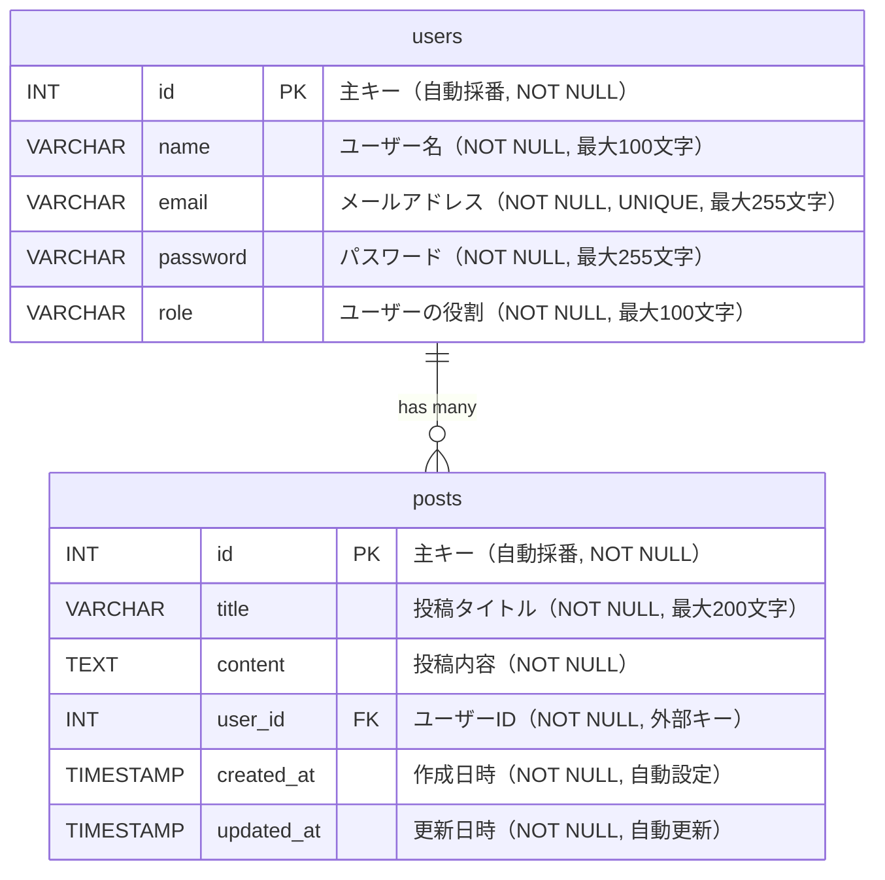

# BBSアプリケーションのテーブル設計とER図

```mermaid

erDiagram
    users {
        INT id PK "主キー（自動採番, NOT NULL）"
        VARCHAR name "ユーザー名（NOT NULL, 最大100文字）"
        VARCHAR email "メールアドレス（NOT NULL, UNIQUE, 最大255文字）"
        VARCHAR password "パスワード（NOT NULL, 最大255文字）"
        VARCHAR role "ユーザーの役割（NOT NULL, 最大100文字）"
    }

    posts {
        INT id PK "主キー（自動採番, NOT NULL）"
        VARCHAR title "投稿タイトル（NOT NULL, 最大200文字）"
        TEXT content "投稿内容（NOT NULL）"
        INT user_id FK "ユーザーID（NOT NULL, 外部キー）"
        TIMESTAMP created_at "作成日時（NOT NULL, 自動設定）"
        TIMESTAMP updated_at "更新日時（NOT NULL, 自動更新）"
    }

    users ||--o{ posts : "has many"


```